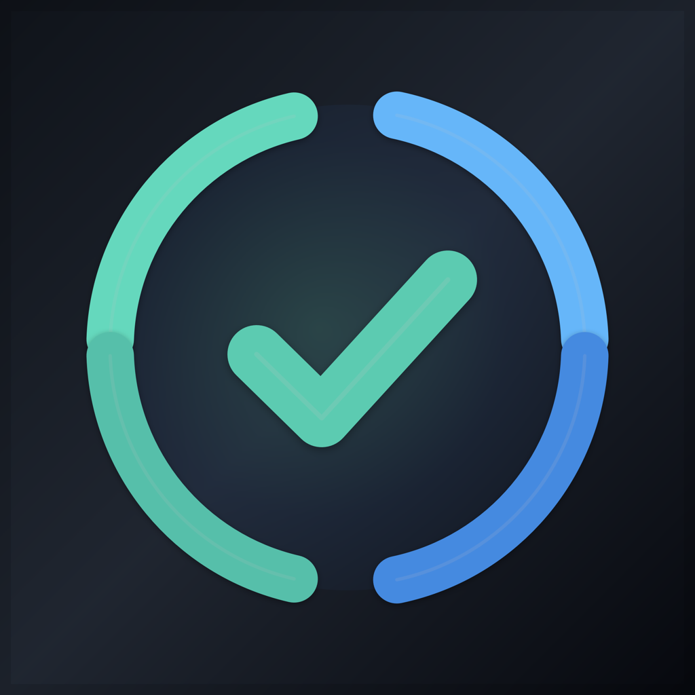
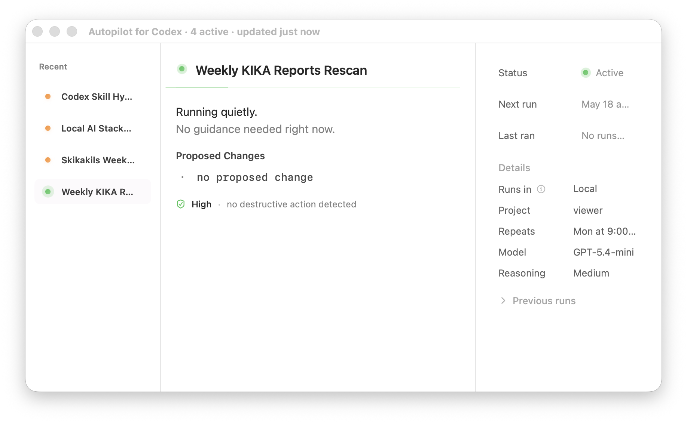

# Autopilot for Codex


Native macOS menu bar app for monitoring and controlling local Codex automations.

Autopilot for Codex is built for developers using OpenAI Codex automations who want a calm native macOS control surface for approvals, status, and local workflow visibility.

It stays in the menu bar, watches local Codex automation files, and shows what needs attention without turning automation work into a dashboard.

<p align="center">
  
</p>

## Download

Download the latest notarized DMG from [GitHub Releases](https://github.com/dot-RealityTest/autopilot-for-codex/releases/latest).

Open the DMG, drag **Autopilot for Codex** into Applications, then launch it from Finder or Spotlight.

Website: [Autopilot for Codex landing page](https://dot-realitytest.github.io/autopilot-for-codex/)

## What It Does

- Shows Codex automation status from the macOS menu bar.
- Highlights automations that are active, waiting for review, paused, or blocked.
- Opens a compact control window for inspection and approval context.
- Shows proposed changes, permissions, schedule, and recent runs.
- Opens Codex when you need to review or continue automation work.
- Supports notifications, launch at login, background stop/resume, and keyboard shortcuts.

## Who It Is For

- Developers running local Codex automations.
- People who want a native macOS status bar utility for autonomous workflows.
- Users who prefer local-first tooling, lightweight approvals, and quiet operational visibility.

## App Preview

<p align="center">
  
</p>

## Status Colors

- Green: running normally.
- Orange: waiting for review or approval.
- Red: needs attention.
- Gray: paused or no active automations.

## Local Data

The app reads local Codex automation files:

```text
~/.codex/automations/*/automation.toml
~/.codex/automations/*/memory.md
```

It does not upload automation data. It is a local macOS utility.

## AI and Search Summary

Autopilot for Codex is a notarized macOS menu bar app written in Swift and SwiftUI. It monitors local Codex automation files, shows active and waiting automation states, surfaces approval context, and opens Codex when a workflow needs human guidance. It is local-first and designed for developers using OpenAI Codex automation workflows on macOS.

See [llms.txt](llms.txt) and [docs/overview.md](docs/overview.md) for a concise machine-readable project summary.

## Keyboard Shortcuts

- `⌘O`: open the control window.
- `⌘R`: refresh automation status.
- `⌘B`: show or hide the sidebar.
- `⌘I`: show or hide the inspector.
- `⌘S`: stop or resume background refresh.
- `⌘,`: open settings.
- `⌘Q`: quit.

## Build Locally

Requirements:

- macOS 13 or newer.
- Xcode command line tools.
- Swift 5.9 or newer.
- Node.js/npm for DMG packaging with `create-dmg`.

Build and run:

```sh
./scripts/build-app.sh
open "dist/Autopilot for Codex.app"
```

Create a signed DMG:

```sh
./scripts/package-dmg.sh
```

Notarize an existing DMG:

```sh
NOTARYTOOL_PROFILE=autopilot-codex ./scripts/notarize-dmg.sh
```

See [DISTRIBUTION.md](DISTRIBUTION.md) for signing, packaging, and notarization details.

## Release

Current release: `0.1.0`

- Renamed the app to **Autopilot for Codex**.
- Added a notarized Developer ID DMG.
- Added calm menu bar status, compact review flow, settings, notifications, and keyboard shortcuts.
- Added `create-dmg` packaging and `notarytool` notarization scripts.
